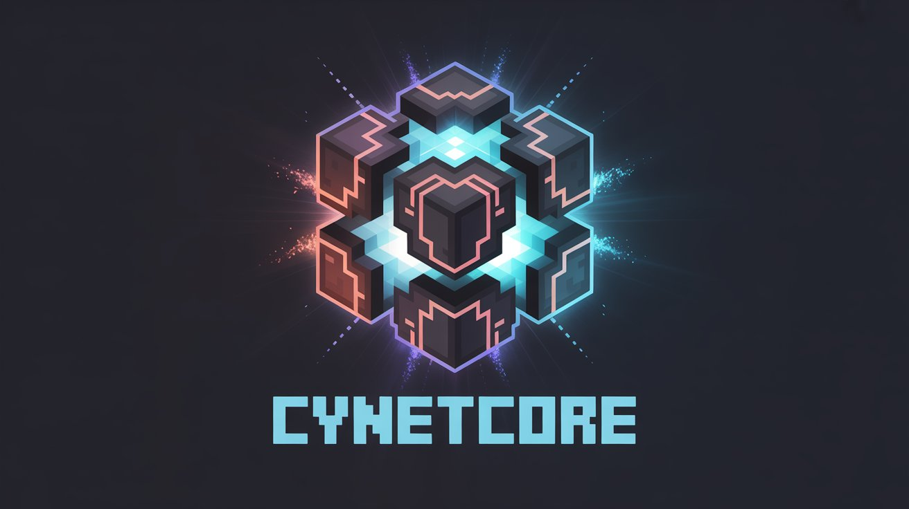

 

 

[ **🇬🇧 English** ](#-en--welcome-to-the-core) | [ **🇮🇷 Persian** ](#-fa--هسته-رسمی-تیم-cynet)

---

## 🎮 EN — Welcome to the Core

> **CynetCore** is the stealthy, all-in-one core plugin designed by **Cynet Team**. It brings a complete ecosystem to your **Spigot** or **Paper** server with a focus on PvE/PvP experience, economy, and modern UI.

### 🚀 Why CynetCore?
- 🛒 **Full Server Shop:** Built-in economy (`Ccoin`) with a sleek Buy/Sell GUI.
- 🎁 **Rewards System:** Auto playtime rewards & daily missions with streak tracking.
- 📢 **Smart Broadcasts:** Beautiful auto-messages, mission announcements, and welcome titles.
- 📊 **Visual Suite:** Advanced Tablist, Sidebar (Scoreboard), and ActionBars.
- 🛡️ **Core Security:** Safe login flow, spawn protection, anti-void, and invulnerability frames.
- ⚙️ **100% Configurable:** Control every single message, setting, and feature via `config.yml`.

### 📦 Installation
1.  **Download** the `CynetCore.jar` from [GitHub Releases](https://github.com/Cynetx/CynetCore/releases/latest).
2.  **Drop** it into your server's `plugins` folder.
3.  **Start** the server to generate the configuration files.
4.  **Enjoy!** (Edit `config.yml` to customize messages and settings).

### 💻 Commands
| Command | Description |
| :--- | :--- |
| `/sp` | 🛒 Open the Server Shop GUI |
| `/daily` | 📅 View Daily Missions & Streak Progress |
| `/discord` | 💬 Copy Discord Invite Link |
| `/ts` | 🎧 Copy TeamSpeak IP |

### 🌍 Modrinth Page
Want updates, releases, and the latest info?
[👉 Visit CynetCore on Modrinth](https://modrinth.com/plugin/cynetcore)

### ✨ Features Breakdown

#### 🛒 Server Shop & Economy
*   **Smart Categories:** Auto-sorts blocks, tools, combat items, and more.
*   **Dynamic Pricing:** Set multipliers or override specific item prices in config.
*   **User Friendly:** Supports Left/Right/Shift clicks for bulk buy/sell actions.

#### 🎯 Daily Missions & Playtime
*   **Missions:** Varied objectives like `Block Break`, `Kill Mobs`, `Playtime`, and `Trade`.
*   **Streaks:** Keep playing daily to build your streak and earn bigger rewards!
*   **Passive Income:** Earn `Ccoin` automatically just by playing on the server.

#### 🎨 Visuals & Immersion
*   **Tablist:** Live statistics (Online count, TPS, Ping, RAM usage).
*   **Sidebar:** Dynamic, lag-free scoreboard with hex color support.
*   **Welcome:** Custom Title/ActionBar + Sound effect on player join.
*   **Branding:** Custom "Logo" message displayed in chat.

#### 🔐 Security & Management
*   **Gamemode Menu:** Optional GUI for easy mode selection (can be disabled).
*   **Spawn Safety:** Anti-void teleport logic & temporary invulnerability.
*   **Keep Inventory:** Configurable option to save items on death.

---

## 🇮🇷 FA — هسته رسمی تیم Cynet

> **سلام! خوش اومدی به دنیای CynetCore**
> اگر دوست داری سرورت یه هسته‌ی خفن و تمیز داشته باشه که هم ظاهرش حرفه‌ای باشه، هم امکانات کامل داشته باشه و هم راحت بتونی همه چیز رو شخصی‌سازی کنی، این پلاگین دقیقاً همون چیزیه که دنبالش بودی. CynetCore برای سرورهای Spigot و Paper (نسخه 1.21 به بالا) تست شده و برای حالت‌های Survival و BoxPvP عالی جواب می‌ده.

### 🤝 چرا CynetCore؟
ما تو تیم Cynet سعی کردیم هر چیزی که واقعاً به درد سرور می‌خوره رو یکجا جمع کنیم، بدون این‌که سرورت سنگین یا شلوغ بشه. نتیجه‌اش یه پلاگین سبک، سریع و کامل شده که هم برای پلیر جذابه، هم برای ادمین راحت و منطقیه.

### ✨ امکاناتی که حسابی به کارت میاد

#### 🛒 فروشگاه حرفه‌ای و اقتصادی
یه شاپ همه‌چی‌تموم که:
*   **هوشمنده:** آیتم‌ها رو خودش دسته‌بندی می‌کنه (بلاک‌ها، ابزارها، ردستون و...).
*   **منطقیه:** با ارز اختصاصی `Ccoin` کار می‌کنه و قیمت‌ها هم قابل تنظیمه.
*   **راحت و سریع:** پلیر با کلیک چپ/راست/شیفت خرید و فروش می‌کنه، شما هم می‌تونی قیمت هر آیتم رو جدا تنظیم کنی یا با ضریب کلی کنترلش کنی.

#### 🎯 ماموریت‌ها و پاداش‌ها
برای اینکه پلیرها بیشتر آنلاین بمونن:
*   **پاداش تایم بازی:** هر مقدار بازی، سکه می‌گیرن.
*   **ماموریت روزانه:** مثل کندن بلاک، کشتن ماب، خرید/فروش و...  
*   **استریک:** اگه هر روز بازی کنن، استریکشون بالا میره و پاداش بهتر می‌گیرن.

#### 🎨 ظاهر حرفه‌ای و جذاب
*   **Tablist و Sidebar:** اطلاعات مهم همیشه جلوی چشم پلیرهاست، بدون لگ.
*   **خوش‌آمدگویی شیک:** با Title/ActionBar و صدا.
*   **لوگوی سرور:** یه واترمارک شیک توی چت که برند سرورت دیده بشه.
*   **پیام‌های خودکار:** هر چند ثانیه پیام‌های خوشگل و کاربردی برای پلیرها.

#### 🛡️ امنیت و مدیریت راحت
*   **تلپورت امن:** جلوگیری از مرگ توی Void یا گیر کردن تو بلاک.
*   **گیم‌مود منو:** اگه بخوای، منوی تغییر مود هم هست (قابل خاموش کردن).
*   **Keep Inventory:** تنظیم می‌کنی آیتم‌ها بعد مرگ بمونه یا نه.

### 📦 نصب خیلی ساده
1. فایل `CynetCore.jar` رو از [GitHub Releases](https://github.com/Cynetx/CynetCore/releases/latest) بگیر و داخل پوشه `plugins` بذار.
2. سرور رو روشن کن تا فایل‌های کانفیگ ساخته بشن.
3. برو توی `config.yml` و هرچی دوست داری رو تغییر بده.

### 💻 دستورات
| دستور | کاربرد |
| :--- | :--- |
| `/sp` | باز کردن شاپ سرور |
| `/daily` | دیدن ماموریت‌ها و وضعیت استریک |
| `/discord` | گرفتن لینک دیسکورد سرور |
| `/ts` | گرفتن آی‌پی TeamSpeak سرور |

### 🌍 صفحه Modrinth
نسخه‌های جدید، توضیحات کامل و آپدیت‌ها اینجا هستن:
[👉 CynetCore در Modrinth](https://modrinth.com/plugin/cynetcore)

---
*CynetCore با عشق ساخته شده تا هم سرور قوی‌تر بشه، هم پلیرها لذت بیشتری ببرن. امیدواریم ازش حال کنی!* ❤️

---

### 🛠️ Developer & Support

**Developed with ❤️ by [Sabine](https://github.com/Cynetx)**

📢 **Bugs & Suggestions:**
[Telegram](https://t.me/cynetx) | [Discord](https://discord.gg/JTpfchCFDV)

*Copyright © 2026 Cynet Team. All rights reserved.*

